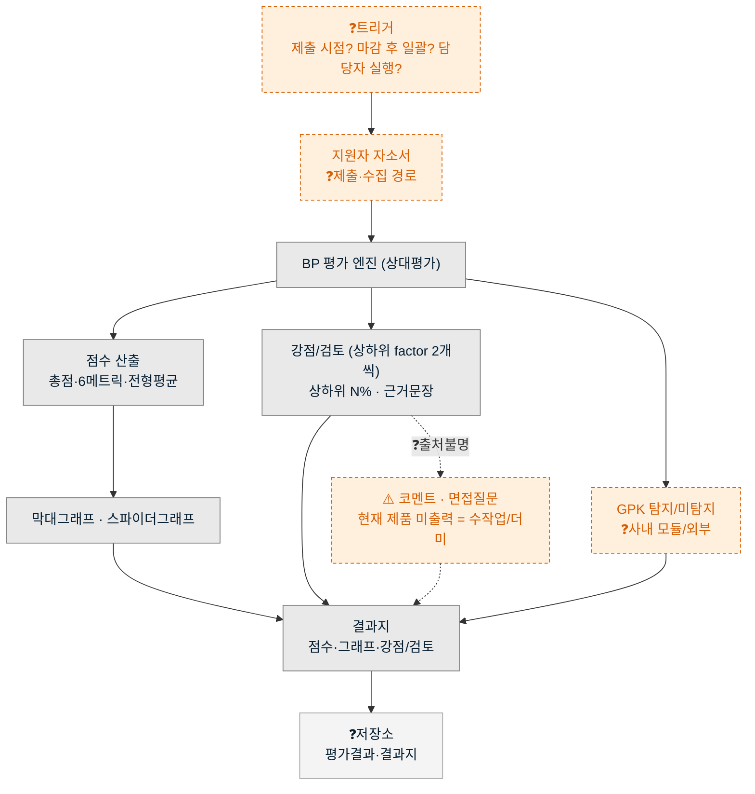
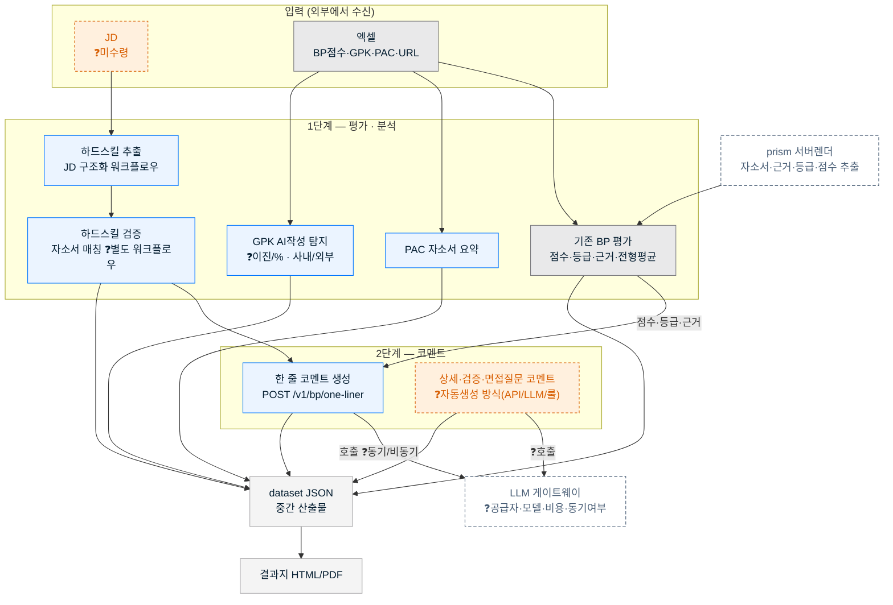

# 서비스 데이터 흐름도 (AS-IS / TO-BE)

> **범위**: BP 평가 → (신규) 하드스킬·PAC·GPK → 한 줄 코멘트 → 결과지. **데이터/트래픽 흐름 · 외부 연동 · API 호출** 관점.
> 작성 2026-06-19 · 출처: `한일시멘트/작업계획서.md` §11·§13, `한줄코멘트/한줄코멘트-생성-API-20260617.md` §0·§1, `하드스킬/하드스킬-추출-API설계-20260616.md` §12
> ⚠️ **`❓` = 미확정(수집·결정 필요).** 흐름도의 "노드 내용"은 채워졌으나 "노드를 잇는 골격(트리거·저장소·외부경계·동기여부·API 인터페이스)"이 비어 있다. 빈칸은 §5 체크리스트로 채운다.

---

## 0. 읽는 법 (범례)

| 표기 | 의미 |
|---|---|
| 🩶 회색 박스 | **기존**(현재 제품이 실제로 수행/출력) |
| 🟦 파랑 박스 | **신규**(TO-BE에서 추가되는 처리) |
| 🟧 주황 점선 `❓` | **미확정** — 수집하거나 결정해야 채워지는 정보 |
| ⬛ 네이비 점선 | **외부 시스템**(무하유 서비스 경계 밖 또는 별도 워크플로우) |
| 원통/저장소 | **데이터 저장소·중간 산출물** |
| 실선 `-->` | 확정된 데이터 흐름 (점선·`❓`라벨은 미확정 경로·호출 방식) |

> ⚠️ 한 가지 함정: **결과지에 보이는 것 ≠ 현재 제품이 실제 출력하는 것.** 강점/검토의 *코멘트·면접질문*, 상세평가 코멘트, 요약 헤드라인 등은 현재 제품이 **내보내지 않아 수작업/더미로 채워져 있다**(작업계획서 §11-2, 한줄코멘트 §0). 그래서 AS-IS에서 이 부분을 "기존 출력"으로 두면 흐름도가 틀어진다. 아래 도식은 이를 `⚠️`로 분리했다.

---

## 1. AS-IS — 현재 BP평가 서비스

### 설명

- **흐름**: (❓트리거) → 자소서 입력 → BP 평가 엔진 → ① 점수 산출 → 막대·스파이더 그래프, ② 강점/검토(상하위 factor 2개·상하위 N%·근거문장) → 결과지 렌더 → (❓저장).
- **실제 출력으로 확인된 것**(한줄코멘트 §1): 상대평가 점수(총점·6메트릭)·전형평균·역량 등급(high/mid/low/none)·근거문장·GPK 이진값.
- **⚠️ 한계 3가지** (TO-BE에서 해결 대상):
  1. **코멘트·면접질문이 실제 출력이 아니다** — 강점/검토 박스의 서술 코멘트와 면접질문은 현재 제품이 생성하지 않아 사람이 채운다(더미). → TO-BE의 "코멘트 자동생성(C)" 대상.
  2. **GPK의 위치가 불명** — 사내 모듈인지 외부 솔루션인지, 호출 방식·반환값(이진/%)이 정의돼 있지 않다.
  3. **흐름 골격 미정** — 트리거(언제 시작), 저장소(어디 저장), 동기/비동기가 도식화되어 있지 않다.

---

## 2. TO-BE — 신규 4종(하드스킬·PAC·GPK) + 한 줄 코멘트

### 설명

**1단계 — 평가·분석 (기존 + 신규 3종)**
- **기존 BP 평가**: 점수·등급·근거·전형평균. 입력은 엑셀(점수·GPK·PAC·URL)과 prism 서버렌더 추출(자소서·근거·등급)이 양쪽에서 들어온다(작업계획서 §11-3). *주의: 이 입력 토폴로지는 현 한일시멘트 파이프라인 기준이며, 제품 정식 API로 대체할지 미정.*
- **하드스킬 (신규)**: **추출**(JD → 구조화 워크플로우, §12)과 **검증**(추출된 스킬을 각 자소서에서 검출/미검출 판단)이 **별도 2단계**다. 추출 워크플로우 범위엔 검증이 없다(§12-4). → **JD 미수령**으로 현재 INTERIM 수작업.
- **PAC (신규)**: 자소서 요약 → P1 요약카드의 headline·bullets로 매핑. **엑셀 컬럼으로 수신 예정**, 형식 미정(§11-3).
- **GPK (신규)**: AI 작성 탐지. 현재는 이진값(탐지/미탐지)만, % 인터페이스·호출 방식 미정(§11-2).

**2단계 — 코멘트**
- **한 줄 코멘트 (신규, 설계 완료)**: 1단계 산출물(점수·등급·근거)에 **의존** → LLM 호출 → 한 문장(강점→단점→액션). 인터페이스 설계됨(`POST /v1/bp/one-liner`). 단 **LLM 공급자·동기여부는 미정**.
- **상세·검증·면접질문 코멘트 자동생성 (C)**: 현재 사람이 쓰는 유일한 영역. **API 연동 / LLM 생성 / 룰 베이스 중 방식 미정** — 작업계획서 §13-3이 "사람 개입 0의 최대 관문"으로 지목.

**산출**: 모든 단계 산출 → `dataset JSON`(중간) → 빌드 → 결과지 HTML/PDF.

---

## 3. 외부 연동 (정해야 할 것)

| 시스템 | 역할 | 사내/외부 | 인터페이스 | 상태 |
|---|---|---|---|---|
| **LLM 게이트웨이** | 한 줄 코멘트·(C)코멘트 생성 | ❓ | ❓공급자·모델·비용·rate limit | 🟧 미정 (자동화 핵심, §13-3) |
| **GPK 엔진** | AI 작성 탐지 | ❓사내/외부 | ❓API/배치·이진 vs % | 🟧 미정 |
| **prism 서버렌더** | 자소서·근거·등급·점수 추출 | 사내 | URL fetch | 🟡 TO-BE에서 유지/대체 여부 ❓ |
| **고객사 입력 채널 (ATS?)** | JD·엑셀·URL 수신 | 외부 | ❓파일 업로드/연동 | 🟧 미정 |
| **JD 구조화 워크플로우** | 하드스킬 추출 | 사내(별도) | Streamlit 프로토타입(§12) | 🟡 JD 미수령 |

---

## 4. API 호출 (정해야 할 것)

| API / 처리 | 단계 | 엔드포인트 | 요청 → 응답 | 동기? | 상태 |
|---|---|---|---|---|---|
| 기존 BP 평가 | 1 | ❓ | 자소서 → 점수·등급·근거·전형평균·GPK | ❓ | ⚠️ 정식 API 스펙 미확정(현재 결과지 추출로 우회, 한줄코멘트 §1) |
| 하드스킬 **추출** | 1 | ❓ | JD → 표준 하드스킬 목록 | ❓ | 🟡 JD 수령 시 (§12) |
| 하드스킬 **검증** | 1 | ❓ | 스킬+자소서 → 검출/미검출+근거ID | ❓ | 🟧 별도 워크플로우 미정 |
| PAC | 1 | ❓ | 자소서 → 요약(headline·bullets) | ❓ | 🟧 엑셀 컬럼 형식 미정 |
| GPK | 1 | ❓ | 자소서 → 탐지/미탐지(또는 %) | ❓ | 🟧 미정 |
| **한 줄 코멘트** | 2 | `POST /v1/bp/one-liner` | digest(점수·등급·근거) → one_liner | ❓ | 🟦 설계 완료, 공급자·동기여부 미정 |
| 코멘트 자동생성 (C) | 2 | ❓ | 평가결과 → 상세·검증·면접질문 코멘트 | ❓ | 🟧 방식(API/LLM/룰) 미정 |

---

## 5. ❓ 수집 · 결정 체크리스트 (이 문서를 완성하려면)

> 아래를 채우면 위 도식의 모든 `❓`가 사라진다. (작업계획서 §13-2의 잔여 자동화 갭과 연동)

**A. 흐름 골격**
- [ ] 시작 **트리거**: 지원자 제출 시점 / 접수 마감 후 일괄 / 담당자 수동 실행 중 무엇인가
- [ ] **시스템 노드 경계**: BP·하드스킬·PAC·GPK·한줄코멘트가 한 서비스 내 모듈인가, 각각 별도 API/서비스인가
- [ ] **데이터 저장소**: 자소서 원문·평가결과·결과지(HTML/PDF)의 영속화 위치
- [ ] **동기/비동기·트래픽**: 실시간 1건 처리 vs 배치 N건, LLM 호출 지연·실패 시 재시도

**B. 외부 연동**
- [ ] **LLM 공급자·모델·게이트웨이·비용** (한 줄 코멘트·C 공용) — *자동화 최대 관문(§13-3)*
- [ ] **GPK**: 사내/외부, 호출 방식, 반환값(이진 vs %)
- [ ] **prism 서버렌더**: TO-BE에서 유지할지 / 정식 BP API로 대체할지
- [ ] **입력 채널**: JD·엑셀·URL이 들어오는 경로(파일 업로드 / ATS 연동 등)

**C. API 인터페이스**
- [ ] **기존 BP 평가**의 정식 응답 스키마·엔드포인트 (현재 결과지 추출로 우회 중)
- [ ] **JD 수령** → 하드스킬 추출 가동 (무근거 금지 규칙상 JD 없이 추출 불가, §12-4)
- [ ] **하드스킬 검증** 워크플로우 정의 (추출과 별개)
- [ ] **PAC** 엑셀 컬럼 형식 → 요약카드 슬롯 매핑
- [ ] **한 줄 코멘트** 호출 위치(평가 직후 1스텝 동기 vs 별도)

**D. 핵심 결정 (콘텐츠)**
- [ ] **(C) 코멘트 자동생성 방식**: API 값 연동 / LLM 자동생성 / 룰 베이스 — 택1
- [ ] **상위%·배수컷·상위10%** 산출 정책 (현재 5명 소표본 가정값, 신뢰도 낮음)
- [ ] 강점/검토 **코멘트·면접질문**의 생성 주체 확정(현재 수작업/더미)

---

> **다음 단계**: 위 체크리스트의 A~D를 결정하면 `❓`를 실제 값으로 치환해 도식을 갱신한다. 별도 열람/인쇄용 완성본이 필요하면 동일 내용을 HTML(인라인 SVG)로 변환 가능.
